```{=html}
<!-- PASSWORD PROTECTION OVERLAY -->
<div id="passwordOverlay" class="password-overlay">
<div class="password-modal">
<h1 style="color: #8b6f47; margin-bottom: 20px; white-space: nowrap;">🤠&nbsp;Enter Password&nbsp;🤠</h1>
<p style="color: #5c4033; margin-bottom: 20px;">This is an exclusive event. Please enter the password to access the details.</p>
<input type="password" id="mainPasswordInput" placeholder="Enter password..." style="padding: 12px; width: 100%; border: 2px solid #c08552; border-radius: 5px; font-size: 1em; margin-bottom: 15px;">
<button onclick="mainCheckPassword()" style="background: #c08552; color: white; padding: 12px 30px; border: none; border-radius: 5px; font-size: 1em; cursor: pointer; font-weight: bold; width: 100%; transition: background 0.3s ease;">Unlock</button>
<div id="mainErrorMessage" style="color: #c08552; margin-top: 10px; font-weight: bold; text-align: center;"></div>
</div>
</div>

<div class="container" id="mainContainer" style="display: none;">
<div class="header">
<h1>Carsen's Last Ride 🤠</h1>
<p>A Desert Cowgirl Bachelorette Weekend</p>
<div class="emoji-display">🌵 🐎 💍 🌙 ✨</div>
</div>

<div class="tabs">
<button class="tab-button active" data-tab="welcome">Welcome</button>
<button class="tab-button" data-tab="staying">Casa & Contacts</button>
<button class="tab-button" data-tab="itinerary">Itinerary</button>
<button class="tab-button" data-tab="packing">What to Bring</button>
<button class="tab-button" data-tab="blog">Learn More</button>
<button class="tab-button" data-tab="recs">Local Recs</button>
</div>

<!-- WELCOME TAB -->
<div id="welcome" class="tab-content active">
<div class="welcome-content">

<h2>Welcome, Cowgirls! 🌹</h2>
<p>You're invited to celebrate Carsen's last weekend of debauchery in the magical desert town of Santa Fe, New Mexico!</p>

<div class="dates">
<p>April 30 – May 3, 2026</p>
</div>

<div class="location">
<p>📍 Santa Fe, New Mexico</p>
<p style="font-size: 0.95em; margin-top: 8px;">Art, Adobe & Adventure await!</p>
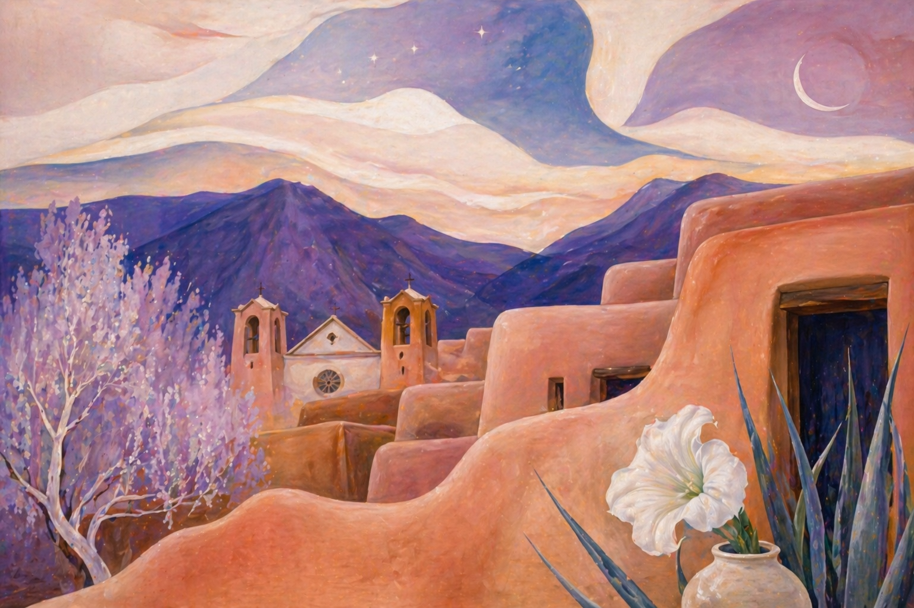
</div>

<p>Get ready for art galleries, cowgirl nights out, surprise activities, wine tours, hot springs, nature, and all the sass you can handle. This is her last ride before she becomes a Hot Cross Bahn, and we're making it unforgettable.</p>

<p style="font-size: 1.2em; font-weight: bold; color: #8b6f47;">Let's make some memories! 💕</p>

<h3 style="margin-top: 40px; text-align: center;">Who's Coming? 👯‍♀️</h3>
<div class="contact-list" style="max-width: 600px; margin: 20px auto;">
<div class="contact-item">
<span class="contact-name">🎀 The Bride 🎀</span>
<span class="contact-phone">Carsen</span>
</div>
<div class="contact-item">
<span class="contact-name">Abby</span>
<span class="contact-phone">Fort Collins</span>
</div>
<div class="contact-item">
<span class="contact-name">Katie</span>
<span class="contact-phone">Fort Collins</span>
</div>
<div class="contact-item">
<span class="contact-name">Rachel</span>
<span class="contact-phone">Fort Collins</span>
</div>
<div class="contact-item">
<span class="contact-name">Caitlin</span>
<span class="contact-phone">Fort Collins</span>
</div>
<div class="contact-item">
<span class="contact-name">Claire</span>
<span class="contact-phone">Washington DC</span>
</div>
<div class="contact-item">
<span class="contact-name">Erin</span>
<span class="contact-phone">Fort Collins</span>
</div>
<div class="contact-item">
<span class="contact-name">Jules</span>
<span class="contact-phone">Fort Collins</span>
</div>
</div>
</div>
</div>

<!-- WHERE WE'RE STAYING TAB -->
<div id="staying" class="tab-content">
<h2>Where Are We Staying? 🏠</h2>

<div class="house-info">
<h3>Our Santa Fe Casa 🏠</h3>

<div style="display: grid; grid-template-columns: repeat(auto-fit, minmax(280px, 1fr)); gap: 15px; margin: 20px 0;">
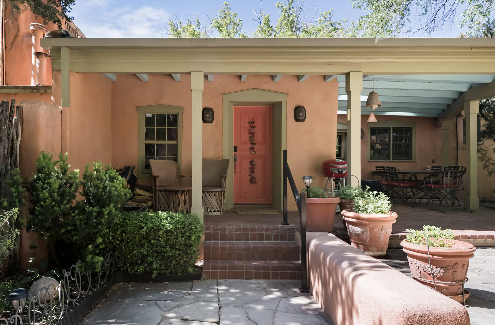
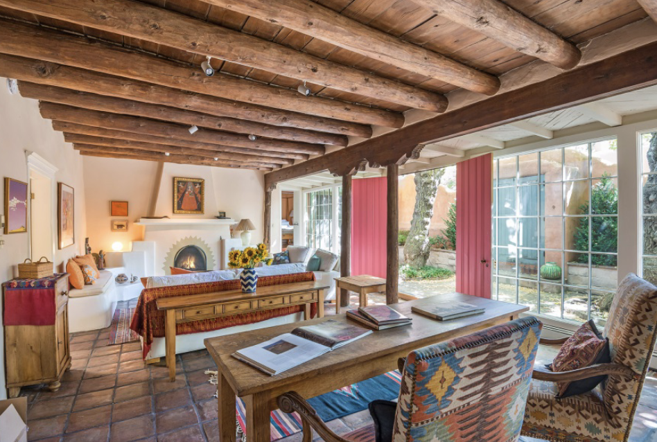
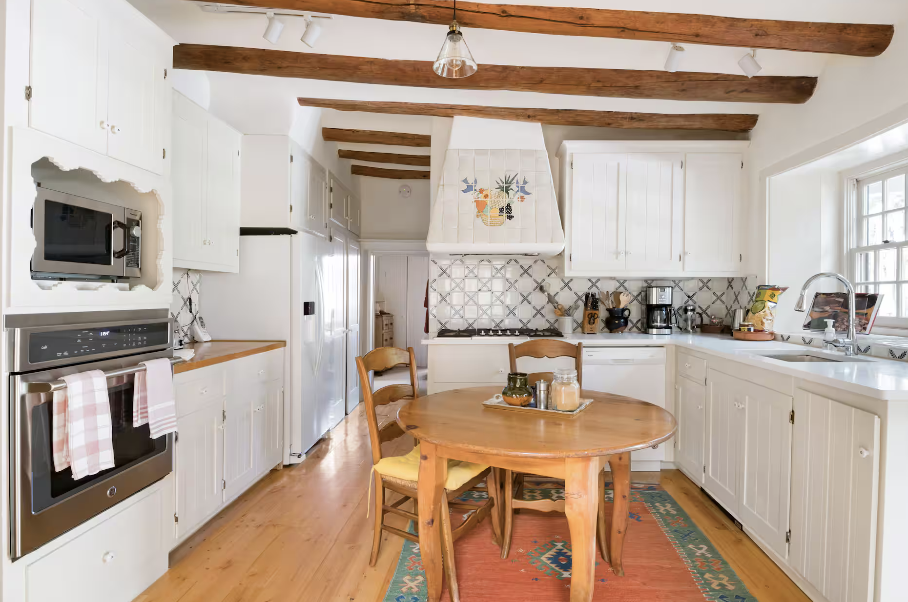
</div>

<div style="background: #faf6f1; border-left: 4px solid #c08552; padding: 20px 25px; margin: 20px 0; border-radius: 5px;">
<p style="color: #5c4033; line-height: 1.8; margin-bottom: 12px;">This gated home, dating back to the 1700s, is located on Santa Fe's historic Canyon Road. Nestled into the foothills of the Sangre de Cristo Mountains, Canyon Road is a magical half-mile in the Historic District of Santa Fe. Since its early Native American and Spanish roots, Canyon Road has been a trail of abundance – initially as a farming community and later as the site of an art colony. Stroll along this picturesque trail to experience fine art, great shopping, and a delicious variety of excellent dining.</p>
<p style="color: #5c4033; line-height: 1.8; margin-bottom: 12px;">While gracious adobe architecture gives Canyon Road its Old-World charm, diversity is its claim to fame. Whether you prefer Contemporary, Traditional, or Native American fine art, it's all here, including paintings, indoor and outdoor sculptures, glass, jewelry, clothing, accessories, home furnishings, gifts, antiques, rugs, folk art, and crafts.</p>
<p style="color: #5c4033; line-height: 1.8; margin: 0; font-style: italic;">This home is an authentic adobe house and belongs to the artist whose work you'll see throughout.</p>
</div>

<div class="address">
907 Canyon Road<br>
Santa Fe, NM 87501
</div>

<div class="airbnb-link">
<p style="color: #5c4033; margin-bottom: 10px;">Book details:</p>
<a href="https://www.airbnb.com/rooms/21145871?unique_share_id=e55563da-a45e-426b-abba-b4f15370d117&viralityEntryPoint=1&s=76&source_impression_id=p3_1777227185_P3Nce4y8zKBvmhvc" target="_blank">View on Airbnb →</a>
</div>

<div style="background: #fff9f3; border-left: 4px solid #c08552; padding: 15px 20px; margin: 20px 0; border-radius: 5px;">
<p style="color: #5c4033; margin: 0;"><strong>📶 Wi-Fi password:</strong> <code style="background: #f5e6d3; padding: 2px 8px; border-radius: 3px; font-size: 1.05em;">roadrunner</code></p>
</div>

<div class="contact-list">
<h3 style="margin-top: 0;">Contact Info</h3>
<div class="contact-item">
<span class="contact-name">Abby</span>
<span class="contact-phone">970-481-8440</span>
</div>
<div class="contact-item">
<span class="contact-name">The Bride (Carsen)</span>
<span class="contact-phone">573-450-4419</span>
</div>
<div class="contact-item" style="background: #fdf2e7; border-left: 4px solid #d4a574;">
<span class="contact-name">⭐ Katie (Bach Party Organizer)</span>
<span class="contact-phone">540-247-9221</span>
</div>
<div class="contact-item" style="background: #fdf2e7; border-left: 4px solid #d4a574;">
<span class="contact-name">⭐ Caitlin (Bach Party Organizer)</span>
<span class="contact-phone">952-261-7978</span>
</div>
<div class="contact-item">
<span class="contact-name">Rachel</span>
<span class="contact-phone">970-829-9558</span>
</div>
<div class="contact-item">
<span class="contact-name">Claire</span>
<span class="contact-phone">573-450-0861</span>
</div>
<div class="contact-item">
<span class="contact-name">Erin</span>
<span class="contact-phone">970-402-0741</span>
</div>
<div class="contact-item">
<span class="contact-name">Jules</span>
<span class="contact-phone">317-697-5408</span>
</div>
<div class="contact-item" style="background: #fff9f3; border-left: 4px solid #c08552;">
<span class="contact-name">🏠 Susan (Local Co-Host)</span>
<span class="contact-phone">207-829-3862</span>
</div>
<div class="contact-item" style="background: #fff9f3; border-left: 4px solid #c08552;">
<span class="contact-name">🏠 Audrey (House Owner)</span>
<span class="contact-phone">505-699-6076</span>
</div>
</div>
</div>
</div>

<!-- ITINERARY TAB -->
<div id="itinerary" class="tab-content">
<h2>The Schedule 🗓️</h2>
<div style="text-align: center; margin-bottom: 25px;">
<a href="itinerary-one-pager.pdf" download style="display: inline-block; background: linear-gradient(135deg, #c08552 0%, #8b6f47 100%); color: white; padding: 14px 28px; border-radius: 8px; text-decoration: none; font-weight: bold; font-size: 1em; box-shadow: 0 4px 10px rgba(0,0,0,0.15);">📄 Download Itinerary PDF</a>
</div>
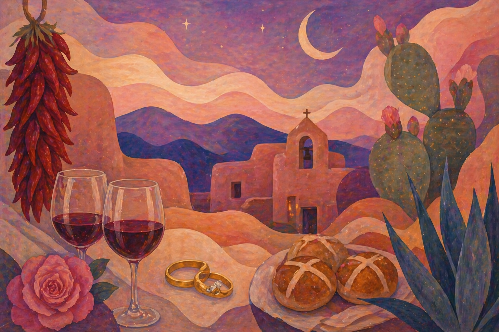

<!-- THURSDAY -->
<div class="day-section">
<div class="day-title">Thursday, April 30 · Ride Into Santa Fe 🚗</div>
<div class="activity">
<div class="activity-time">MORNING</div>
<div class="activity-name">🛣️ Saddle Up & Head Out</div>
<div class="activity-details">Morning departure, wide-open roads ahead</div>
</div>
<div class="activity">
<div class="activity-time">ARRIVAL</div>
<div class="activity-name">🍾Meet at Gruet Winery</div>
<div class="activity-details">210 Don Gaspar Ave, Hotel St. Francis Santa Fe, NM 87501<br><a href="#" onclick="goToBlog('blog-wine'); return false;"><strong>Learn about Gruet & NM wine →</strong></a></div>
</div>
<div class="activity">
<div class="activity-time">5:00 PM</div>
<div class="activity-name">🏠 Check In & Get Settled</div>
<div class="activity-details">907 Canyon Road</div>
<div class="activity-details">Settle in, pour something cold</div>
</div>
<div class="activity">
<div class="activity-time">EVENING</div>
<div class="activity-name">🌼 Make Your Own Flower Crown</div>
<div class="activity-details">Get creative, get festive! <a href="#" onclick="goToBlog('blog-beltane'); return false;"><strong>Learn about Beltane →</strong></a></div>
</div>
<div class="activity">
<div class="activity-time">EVENING</div>
<div class="activity-name">🍽️ Dinner at Home</div>
<div class="activity-details">TBD from the local guide</div>
</div>
</div>

<!-- FRIDAY -->
<div class="day-section">
<div class="day-title">Friday, May 1 · Art, Adobe & Adventure 🎨</div>

<div class="activity">
<div class="activity-time">MORNING</div>
<div class="activity-name">☕ Breakfast at The Tea House</div>
<div class="activity-details">Just across the street from our casa</div>
</div>
<div class="activity">
<div class="activity-time">MORNING</div>
<div class="activity-name">🥾 Morning Nature Sesh</div>
<div class="activity-details">Choose our adventure! Bring swimsuit and hiking gear. <a href="#" onclick="goToBlog('blog-nature'); return false;"><strong>See trail options →</strong></a></div>
</div>

<div class="activity">
<div class="activity-time">AFTERNOON</div>
<div class="activity-name">🎨 Canyon Road & The Plaza</div>
<div class="activity-details">Wander the galleries, explore the Plaza, visit the Georgia O'Keeffe Museum</div>
</div>
<div class="activity">
<div class="activity-time">EVENING</div>
<div class="activity-name">🌮 Dinner at The Shed</div>
<div class="activity-details">(505) 982-9030 · Check on reservations</div>
</div>
<div class="activity">
<div class="activity-time">NIGHT</div>
<div class="activity-name">🤠 Cowgirl Night Out at Cowgirl Santa Fe</div>
<div class="activity-details"><strong>Live music, boot-stomping & all the sass</strong><br>
<strong>Dress Code:</strong> Sophisticated Cowgirl<br>
<a href="https://cowgirlsantafe.com" target="_blank">cowgirlsantafe.com →</a></div>
</div>
</div>

<!-- SATURDAY -->
<div class="day-section">
<div class="day-title">Saturday, May 2 · Surprise & Sip 🍷</div>

<div class="activity">
<div class="activity-time">MORNING</div>
<div class="activity-name">✨ 8 AM Surprise Activity✨</div>
<div class="activity-details"><strong>You'll just have to wait and see...!</strong></div>
</div>
<div class="activity">
<div class="activity-time">10:00 AM – 6:00 PM</div>
<div class="activity-name">🍷 Wine Tour</div>
<div class="activity-details"><strong>Dress Code:</strong> Desert Cult Leader Flower Princess<br>(Flower crowns will be provided!)<br><a href="#" onclick="goToBlog('blog-wine'); return false;"><strong>Learn about NM wine →</strong></a></div>
</div>
<div class="activity">
<div class="activity-time">EVENING</div>
<div class="activity-name">🍕 Dinner</div>
<div class="activity-details">TBD — possibly a home-cooked night in</div>
</div>
</div>

<!-- SUNDAY -->
<div class="day-section">
<div class="day-title">Sunday, May 3 · Last Ride Home 🌙</div>

<div class="activity">
<div class="activity-time">MORNING</div>
<div class="activity-name">🍳 Breakfast</div>
<div class="activity-details">At the house or Tea House across the street</div>
</div>
<div class="activity">
<div class="activity-time">10:00 AM – 3:00 PM</div>
<div class="activity-name">🛍️ Railyard Artisan Market & Farmer's Market</div>
<div class="activity-details">Last chance for turquoise and green chile</div>
</div>
<div class="activity">
<div class="activity-time">11:00 AM</div>
<div class="activity-name">🧳 Checkout</div>
<div class="activity-details">Pack up & say goodbye to Santa Fe (for now)</div>
</div>
<div class="activity">
<div class="activity-time">OPTIONAL</div>
<div class="activity-name">🏔️ Scenic Taos Route Home</div>
<div class="activity-details">Stop at <a href="https://ojosparesorts.com/ojo-caliente/" target="_blank"><strong>Ojo Caliente Mineral Springs</strong></a> for a long soak & a slow farewell to the desert</div>
</div>
</div>

<div class="notes">
<strong>💕 Here's to the last ride she becomes a Hot Cross Bahn!</strong>
</div>
</div>

<!-- PACKING LIST TAB -->
<div id="packing" class="tab-content">
<h2>What to Bring 🎒</h2>

<!-- PASSWORD PROTECTED GIFT SECTION -->
<div id="beltaneOverlay" class="password-overlay" style="position: relative; background: none; margin-bottom: 30px; z-index: 10;">
<div class="password-modal" style="max-width: 600px; padding: 30px; margin: 0 auto;">
<h1 style="color: #8b6f47; margin-bottom: 20px;">✨ No Brides Allowed✨</h1>
<p style="color: #5c4033; margin-bottom: 20px;">This section is password protected for the guests only.</p>
<input type="password" id="beltanePasswordInput" placeholder="Enter password..." style="padding: 12px; width: 100%; border: 2px solid #c08552; border-radius: 5px; font-size: 1em; margin-bottom: 15px;">
<button onclick="beltaneCheckPassword()" style="background: #c08552; color: white; padding: 12px 30px; border: none; border-radius: 5px; font-size: 1em; cursor: pointer; font-weight: bold; width: 100%; transition: background 0.3s ease;">Unlock</button>
<div id="beltaneErrorMessage" style="color: #c08552; margin-top: 10px; font-weight: bold; text-align: center;"></div>
</div>
</div>

<div id="beltaneContent" style="display: none; background: #fff9f3; padding: 25px; border-left: 4px solid #c08552; margin-bottom: 30px; border-radius: 3px;">
<h3 style="color: #8b6f47; margin-bottom: 15px;">🌿 Desert Apothecary Gift Theme 🌿</h3>
<p style="color: #5c4033; line-height: 1.8; margin-bottom: 15px;">Instead of a lingerie gift party for the bride, we are doing a slightly different gift theme: <strong>Desert Apothecary!</strong></p>
<p style="color: #5c4033; line-height: 1.8; margin-bottom: 15px;">Every guest brings something for the bride's body and soul from the natural world - locally made sage bundle, prickly pear body scrub, desert rose bath salts, turquoise face roller, pinon lotion, cactus hair oil...</p>
<p style="color: #5c4033; line-height: 1.8; margin-bottom: 15px;">The idea is she leaves with a full ritualistic self-care collection rooted in the Southwest. She will be able to feel witchy and luxurious.</p>

<h3 style="color: #8b6f47; margin-top: 25px; margin-bottom: 15px;">🥰 YEEHAW Photo Board 🥰</h3>
<p style="color: #5c4033; line-height: 1.8; margin-bottom: 15px;">Erin found a fun YEEHAW sign - we want to set it up at the casa! Please send over your favorite pics with you and Carsen by MONDAY so we can print them all out.</p>
</div>

<div class="notes">
<strong>Travel Days:</strong> Thursday and Sunday are travel days. Pack comfy clothes for the road!
</div>

<div class="packing-list">
<div class="packing-category">
<h4>🧳 Everyday Essentials</h4>
<ul>
<li>Everyday clothing (jeans, shorts, t-shirts, sweater, underwear)</li>
<li>Comfortable walking shoes</li>
<li>Sunscreen & sunglasses</li>
<li>Toiletries & medications</li>
<li>Phone charger</li>
<li>Comfortable travel outfit for Thursday & Sunday</li>
</ul>
</div>
<div class="packing-category">
<h4>🥾 Hiking & Hot Springs</h4>
<ul>
<li>Swimsuit (essential!)</li>
<li>Hiking boots or trail shoes</li>
<li>Hiking clothes (moisture-wicking preferred)</li>
<li>Backpack for hiking</li>
<li>Water bottle</li>
<li>Hat or visor for sun</li>
</ul>
</div>
<div class="packing-category">
<h4>🤠 Cowgirl Night Out (Friday)</h4>
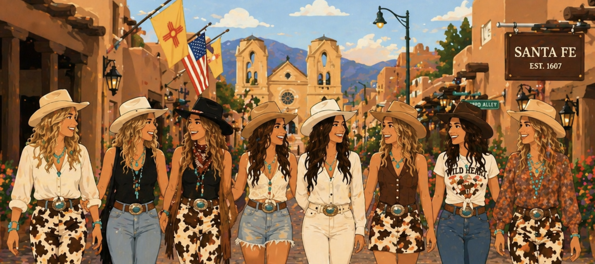
<ul>
<li>Cowgirl outfit (let your inner horse girl shine!)</li>
</ul>
</div>
<div class="packing-category">
<h4>👑 Desert Cult Leader Flower Princess (Saturday)</h4>
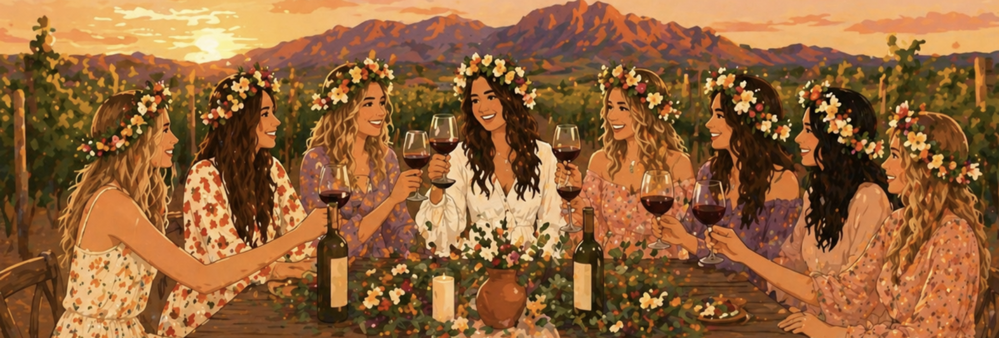
<ul>
<li>Flowy, bohemian dress or outfit</li>
<li>Flower crown materials will be provided!</li>
</ul>
</div>
<div class="packing-category">
<h4>☀️ Desert Weather Must-Haves</h4>
<ul>
<li>High SPF sunscreen (Santa Fe is at 7,000 ft elevation!)</li>
<li>Lip balm with SPF</li>
<li>Sunglasses</li>
<li>Hat or cap</li>
<li>Light jacket or sweater (desert gets cool at night)</li>
<li>Layers for temperature changes</li>
</ul>
</div>
<div class="packing-category">
<h4>📱 Don't Forget</h4>
<ul>
<li>ID & wallet</li>
<li>Phone & charger</li>
<li>Camera (for photos!)</li>
<li>Snacks & any special dietary items</li>
<li>Medications & vitamins</li>
</ul>
</div>
</div>

<div class="notes">
<strong>Pro Tips:</strong>
<ul style="list-style: none; padding-left: 0; margin-top: 10px;">
<li>☀️ Santa Fe sits at 7,000 feet elevation - the sun is stronger!</li>
<li>🌡️ Desert temperatures can swing 20+ degrees between day & night</li>
<li>💧 Stay hydrated in the dry desert air</li>
<li>👢 Comfortable walking shoes are a must for exploring galleries and the Plaza</li>
<li>📸 Bring items for photos - we're making memories!</li>
</ul>
</div>
</div>

<!-- BLOG TAB -->
<div id="blog" class="tab-content">
<h2>Desert Magick & History 🌙✨</h2>

<!-- WHERE TO EXPLORE NATURE -->
<div class="day-section" id="blog-nature">
<div class="day-title">🥾 Where to Explore Nature 🌲</div>
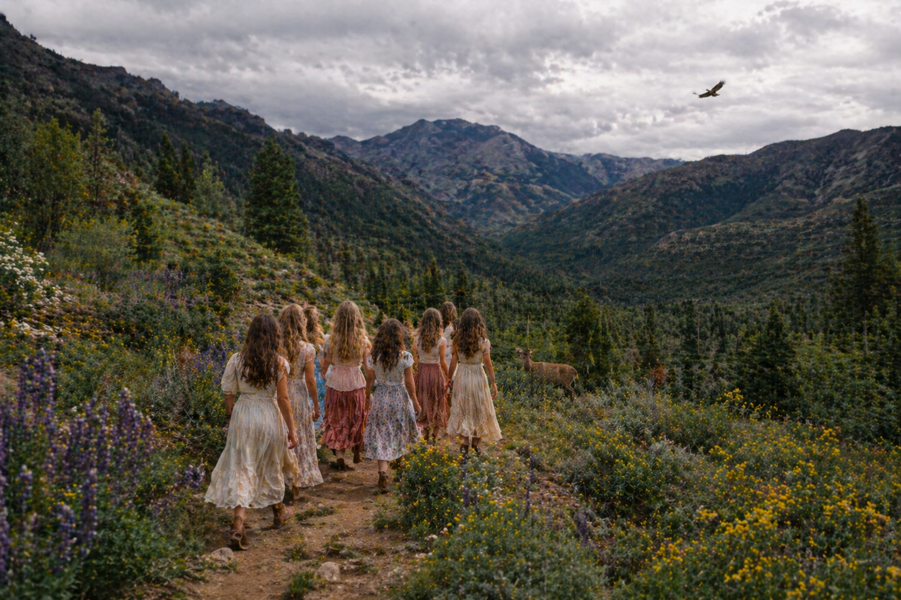
<p style="color: #5c4033; line-height: 1.8; margin-bottom: 15px;">Friday morning is our "choose our adventure" hike day. Pick a trail based on how far we want to drive and what kind of experience we're after—a hot springs soak, a peak summit, or a quick local loop. Bring swimsuit, hiking shoes, water, and sunscreen.</p>

<div class="hiking-options">
<h5>🥾 Spence Hot Springs</h5>
<p><strong>Duration:</strong> 1.5 hours drive</p>
<p><strong>Vibe:</strong> Riverside hot springs nestled along the Jemez River. A short trail leads to a series of natural rock pools fed by geothermal springs—warm, mineral-rich, and dreamy. Best for soaking and relaxing.</p>
<p><a href="https://www.alltrails.com/trail/us/new-mexico/spence-hot-springs-trail" target="_blank">View Trail Details →</a></p>
</div>
<div class="hiking-options">
<h5>🥾 McCauley Hot Springs</h5>
<p><strong>Duration:</strong> 1.5 hours drive</p>
<p><strong>Vibe:</strong> A 3.5-mile round-trip hike through pine forest to a series of warm pools. Slightly cooler temperatures than Spence (think bathwater warm), but the hike adds adventure and the pools are gorgeous.</p>
<p><a href="https://www.alltrails.com/trail/us/new-mexico/mccauley-hot-springs" target="_blank">View Trail Details →</a></p>
</div>
<div class="hiking-options">
<h5>🥾 Atalaya Mountain Trail</h5>
<p><strong>Duration:</strong> 15 minutes drive</p>
<p><strong>Vibe:</strong> A challenging 6-mile out-and-back to a 9,121-ft summit overlooking Santa Fe. Steep but rewarding panoramic views of the city and surrounding mountains. Best for those who want a real workout and a peak.</p>
<p><a href="https://www.alltrails.com/trail/us/new-mexico/atalaya-mountain-trail" target="_blank">View Trail Details →</a></p>
</div>
<div class="hiking-options">
<h5>🥾 Chamisa Trail Loop</h5>
<p><strong>Duration:</strong> 10 minutes drive</p>
<p><strong>Vibe:</strong> An easy-to-moderate 5-mile loop through the Santa Fe National Forest. Pinyon-juniper, ponderosa pine, scenic meadows. Perfect for stretching legs without committing the whole day.</p>
<p><a href="https://www.alltrails.com/trail/us/new-mexico/chamisa-trail-loop" target="_blank">View Trail Details →</a></p>
</div>

<div class="notes">
<strong>🌵 Choosing our trail:</strong> Want to soak? Spence. Want to soak + hike? McCauley. Want a peak? Atalaya. Want short and local? Chamisa. Check current conditions before you go—high desert weather changes fast.
</div>
</div>

<!-- SANTA FE CULTURE -->
<div class="day-section" id="blog-santafe">
<div class="day-title">✨ Santa Fe: Land of Enchantment</div>

<p style="color: #5c4033; line-height: 1.8; margin-bottom: 15px;">Santa Fe, the "City of Holy Faith," sits at 7,000 feet in the heart of northern New Mexico, where Native American, Spanish colonial, and contemporary cultures weave together in a tapestry of art, spirituality, and bohemian charm.</p>

<h4 style="color: #c08552; margin-top: 20px; margin-bottom: 10px;">🏛️ The Pueblo Style & Adobe Architecture</h4>
<p style="color: #5c4033; line-height: 1.8; margin-bottom: 15px;">Santa Fe's distinctive Pueblo Revival architecture, with its earthy adobe walls and rounded corners, originated with the Pueblo people and was embraced by Spanish colonists in the 1600s. Every building in the historic downtown district must conform to these building codes—no glass and steel allowed. Walking Canyon Road feels like stepping through centuries of artistic tradition.</p>

<h4 style="color: #c08552; margin-top: 20px; margin-bottom: 10px;">🎨 The Art Capital of the Southwest</h4>
<p style="color: #5c4033; line-height: 1.8; margin-bottom: 15px;">Santa Fe has more artists per capita than almost any other U.S. city. The legendary Canyon Road alone hosts over 100 galleries. From Native American jewelry and textiles to contemporary fine art, the city celebrates creativity in every plaza and alley. The Georgia O'Keeffe Museum honors the artist who fell in love with the New Mexico landscape and never left.</p>

<h4 style="color: #c08552; margin-top: 20px; margin-bottom: 10px;">🌸 Spiritual & Bohemian Energy</h4>
<p style="color: #5c4033; line-height: 1.8; margin-bottom: 15px;">Santa Fe is known as a vortex of creative energy and spiritual awakening. The mix of indigenous wisdom, Spanish Catholic traditions, and New Age spirituality creates a uniquely open, eclectic atmosphere. You'll find crystal shops next to ancient churches, yoga studios near centuries-old plazas, and everyone seems a little bit witchy.</p>
</div>

<!-- BELTANE -->
<div class="day-section" id="blog-beltane">
<div class="day-title">🔥 Beltane: The Festival of Fire & Fertility 🔥</div>
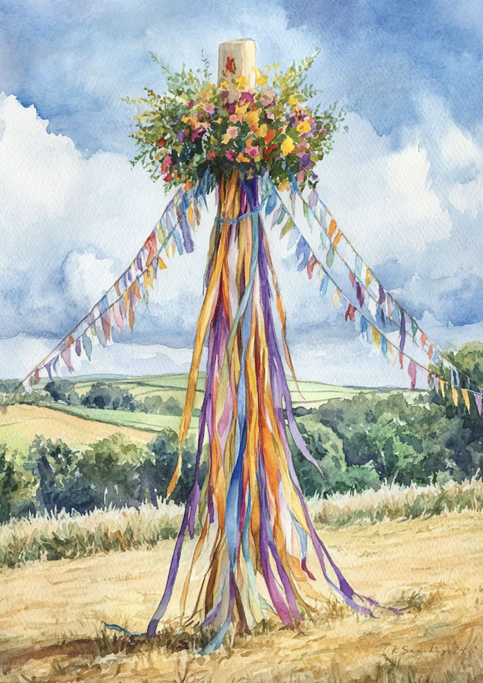
<p style="color: #5c4033; line-height: 1.8; margin-bottom: 15px;">We are arriving in Santa Fe for the exact date of <strong>Beltane</strong>—May 1st—one of the most sacred celebrations in the ancient Celtic calendar. This is not a coincidence.</p>

<h4 style="color: #c08552; margin-top: 20px; margin-bottom: 10px;">📖 What is Beltane?</h4>
<p style="color: #5c4033; line-height: 1.8; margin-bottom: 15px;">Beltane (pronounced BAL-tayn) marks the beginning of summer in the Celtic tradition, falling between the spring equinox and the summer solstice. The name means "bright fire" or "fire of Bel" (the Celtic sun god). Historically, it was a time of fertility rituals, communal bonfires, and the movement of livestock to summer pastures.</p>

<h4 style="color: #c08552; margin-top: 20px; margin-bottom: 10px;">🔮 Beltane & The Bride</h4>
<p style="color: #5c4033; line-height: 1.8; margin-bottom: 15px;">Beltane is profoundly connected to transformation, passage, and sacred union. It celebrates the liminal space between seasons—the threshold between maiden and woman, spring and summer, solitude and partnership. What could be more fitting for a bachelorette weekend? Carsen is at her own Beltane threshold, standing between her old life and the married woman she's about to become. The Desert Apothecary gift theme—with its ritualistic self-care and earth-based remedies—channels this ancient Celtic honoring of transition and sacred preparation.</p>

<h4 style="color: #c08552; margin-top: 20px; margin-bottom: 10px;">🌄 Beltane Energies in the Desert</h4>
<p style="color: #5c4033; line-height: 1.8; margin-bottom: 15px;">While Beltane originated in cool Celtic lands, the May 1st energy translates beautifully to the desert: renewal, fire, sexual energy, fertility, and the full awakening of the earth after winter. The Southwest's own traditions honor the sacred feminine, the power of the earth, and the life-giving properties of ritual. By celebrating in Santa Fe on Beltane, you're tapping into millennia of wisdom about honoring women, marking thresholds, and creating magic.</p>
</div>

<!-- WINE -->
<div class="day-section" id="blog-wine">
<div class="day-title">🍷 Wine of the Region: New Mexico's Secret Gem 🍷</div>
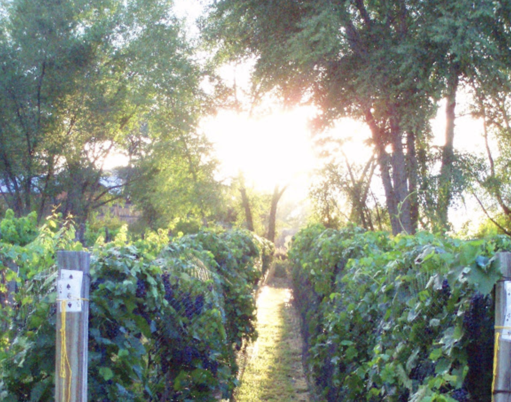
<p style="color: #5c4033; line-height: 1.8; margin-bottom: 15px;">New Mexico is the third-largest wine-producing state in the U.S., yet remains delightfully under-the-radar. The high desert terroir produces bold, distinctive wines with character.</p>

<h4 style="color: #c08552; margin-top: 20px; margin-bottom: 10px;">🥂 Gruet: The Jewel of Santa Fe</h4>
<p style="color: #5c4033; line-height: 1.8; margin-bottom: 15px;">You'll arrive on Thursday at <strong>Gruet Winery</strong>, one of New Mexico's premier producers. Gruet is internationally renowned for its <strong>sparkling wines and champagne-method bubbly</strong>. What started in 1984 as a small family operation has become the state's flagship sparkling wine producer. The high altitude (6,800 feet) and diurnal temperature swings create ideal conditions for crisp, elegant bubbles with excellent acidity—think classic Champagne-style finesse with a New Mexico soul.</p>

<h4 style="color: #c08552; margin-top: 20px; margin-bottom: 10px;">🍇 The Terroir of High Desert Wines</h4>
<p style="color: #5c4033; line-height: 1.8; margin-bottom: 15px;">New Mexico's wine regions sit between 4,000 and 7,000 feet elevation. The altitude means intense sun during the day but cool nights that slow ripening and build acidity. This produces wines with vibrant fruit and mineral character. Red varietals thrive here—Merlot, Cabernet Sauvignon, and Tempranillo show rich, structured profiles. But it's the whites and especially the sparkling wines that shine: crisp, elegant, and distinctive.</p>

<h4 style="color: #c08552; margin-top: 20px; margin-bottom: 10px;">🌶️ The Spirit of New Mexico Wine</h4>
<p style="color: #5c4033; line-height: 1.8; margin-bottom: 15px;">Like Santa Fe itself, New Mexico wine embraces its own identity. You won't find pretentiousness here—just genuine, soulful wines made by people passionate about their terroir. The state wine is red, and many wineries blend in the local culture. It's a fitting libation for a bachelorette weekend that celebrates individuality and the magic of the land.</p>
</div>

<!-- DESERT BLOOMS -->
<div class="day-section" id="blog-blooms">
<div class="day-title">🌵 Desert Blooms: What to Expect in Early May 🌵</div>
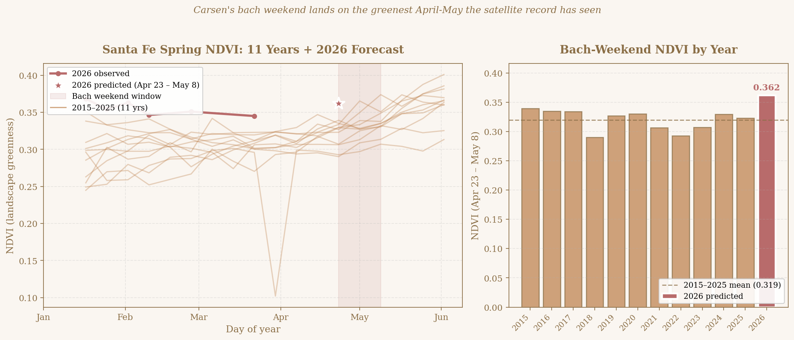
<p style="color: #5c4033; line-height: 1.8; margin-bottom: 15px;">We re-ran our satellite-based bloom model with the most recent data (NDVI through March 22, 2026; climate through April 25, 2026). Here's the latest forecast for what the Santa Fe desert will look like during our weekend:</p>

<h4 style="color: #c08552; margin-top: 20px; margin-bottom: 10px;">📊 The Science of May Blooms</h4>
<p style="color: #5c4033; line-height: 1.8; margin-bottom: 15px;">We analyzed 11 years of MODIS satellite data (2015–2025) to predict what the desert will look like April 23 – May 8, 2026 (the 16-day composite covering our weekend). The model tracks landscape "greenness" (NDVI), driven by winter water-year precipitation and March–April temperatures—the strongest predictors of spring bloom intensity.</p>

<h4 style="color: #c08552; margin-top: 20px; margin-bottom: 10px;">✨ 2026 Spring Bloom Prediction (/h4>
<p style="color: #5c4033; line-height: 1.8; margin-bottom: 15px;"><strong>The headline: an unusually green landscape, but a modest wildflower flush.</strong></p>
<p style="color: #5c4033; line-height: 1.8; margin-bottom: 15px;">The Santa Fe desert entered spring 2026 with a Jan–Feb baseline NDVI of <strong>0.357</strong>—higher than any year in the 11-year record (historical range 0.261–0.332). Predicted absolute NDVI for our weekend (April 23–May 8): <strong>~0.36</strong>, which would be the <strong>greenest the landscape has been at this time of year</strong> in the entire satellite record.</p>
<p style="color: #5c4033; line-height: 1.8; margin-bottom: 15px;">However, the <em>anomaly</em>—the new spring flush above the dormant baseline—is predicted to be <strong>below-average</strong> (around the 27th percentile). This means the wildflower carpet specifically will likely be modest, even though the overall landscape is exceptionally lush.</p>

<h4 style="color: #c08552; margin-top: 20px; margin-bottom: 10px;">🌡️ Why the Mixed Signal?</h4>
<p style="color: #5c4033; line-height: 1.8; margin-bottom: 15px;">Three climate factors are driving this:</p>
<ul style="color: #5c4033; margin-left: 25px; margin-bottom: 15px;">
<li><strong>Winter precip:</strong> 154 mm Oct–Mar—moderate, slightly above the historical average</li>
<li><strong>Spring temperatures:</strong> 12.1°C average for Mar–April—the <strong>warmest in the 11-year record</strong> (next-warmest was 10.4°C in 2017). Warm springs accelerate green-up but can also dry out wildflower habitat.</li>
<li><strong>Jan–Mar precipitation:</strong> only 27 mm—quite dry, which limits the explosive wildflower flush that comes after wetter winters</li>
</ul>
<p style="color: #5c4033; line-height: 1.8; margin-bottom: 15px;">The result: the pinyon-juniper and grass landscape is already loaded with green, but there isn't enough recent moisture to fuel a big surge of new wildflowers.</p>

<h4 style="color: #c08552; margin-top: 20px; margin-bottom: 10px;">📅 Peak Bloom Timing</h4>
<p style="color: #5c4033; line-height: 1.8; margin-bottom: 15px;">Predicted peak NDVI date: <strong>~May 15, 2026</strong> (DOY 135). That's about <strong>13 days AFTER our weekend</strong>—you'll be arriving slightly before the seasonal peak, with the landscape still on the upswing.</p>
<p style="color: #5c4033; line-height: 1.8; margin-bottom: 15px;"><em>Caveat:</em> The peak-date model is the weakest part of the forecast (LOO R²=−0.13), so treat May 15 as a rough estimate with ±8 days of uncertainty.</p>

<h4 style="color: #c08552; margin-top: 20px; margin-bottom: 10px;">🌸 What We'll Actually See</h4>
<ul style="color: #5c4033; margin-left: 25px; margin-top: 10px;">
<li>🌲 <strong>Lush, fully green pinyon-juniper</strong> — the woodland backdrop will be the greenest in over a decade</li>
<li>💚 <strong>Grasslands greening up</strong> — recovering from winter dormancy, on the way to peak</li>
<li>🌼 <strong>Scattered wildflowers</strong> — present but not the carpet you'd see in a wet year (think pleasant accents, not Instagram-famous superbloom)</li>
<li>🌵 <strong>Cactus blooms</strong> — claret cup, prickly pear, and cholla often flower in early May regardless of moisture</li>
<li>🌞 <strong>Abundant warm sunshine</strong> — long days (sunset ~8 PM) and warmer-than-usual temperatures</li>
<li>💨 <strong>Dry conditions</strong> — possible fire restrictions; stay hydrated and check rules before any campfire ideas</li>
</ul>

<h4 style="color: #c08552; margin-top: 20px; margin-bottom: 10px;">📸 Perfect for Photography & Hiking</h4>
<p style="color: #5c4033; line-height: 1.8; margin-bottom: 15px;">Even with a modest wildflower flush, the overall landscape will look stunning—deep green pinyon, golden-to-green grasslands, and dramatic high-desert light. Our hikes to Atalaya Mountain, Chamisa Trail, or the hot springs will be beautiful. Long days mean sunset isn't until 8 PM—plenty of time for evening adventures. Cactus blooms and scattered wildflowers will reward those who look closely.</p>

<h4 style="color: #c08552; margin-top: 20px; margin-bottom: 10px;">⚠️ A Note on Elevation, UV & Heat</h4>
<p style="color: #5c4033; line-height: 1.8; margin-bottom: 15px;">At 7,000 feet with the warmest spring on record, the sun will be intense. Bring high SPF sunscreen, a hat, sunglasses, and extra water—the desert is gorgeous, but the warmer-than-usual conditions mean you'll dehydrate faster than expected.</p>
</div>

<div class="notes" style="text-align: center; margin-top: 40px;">
<strong style="font-size: 1.2em;">🌙 We're arriving at the perfect time—spring's full magick, Beltane's sacred threshold, and wine to celebrate it all. ✨</strong>
</div>
</div>

<!-- LOCAL RECOMMENDATIONS TAB -->
<div id="recs" class="tab-content">
<h2>Local Recommendations 📍</h2>
<p style="color: #5c4033; line-height: 1.7; margin-bottom: 25px; font-style: italic;">Curated recs from Tatiana & Nicholas (the homeowners) for restaurants, museums, hikes, and adventures around Santa Fe.</p>

<!-- WALKING TO TOWN -->
<div class="day-section">
<div class="day-title">🚶‍♀️ Walking to Town</div>
<div class="activity">
<div class="activity-name">Canyon Road Walk</div>
<div class="activity-details">Just under 20 minutes. Stroll along Canyon Road, lined with galleries, shops, and great dining—the most scenic route to the Plaza.</div>
</div>
<div class="activity">
<div class="activity-name">East Palace Walk</div>
<div class="activity-details">A direct alternative route to town.</div>
</div>
</div>

<!-- WALKING-DISTANCE DINING -->
<div class="day-section">
<div class="day-title">🍽️ Walking-Distance Dining (Canyon Road)</div>

<div class="activity">
<div class="activity-name">Tea House <span style="color:#c08552;">· American/Cafe · $$</span></div>
<div class="activity-details">Great brunch, family friendly, coffees, teas. Just across the street!<br>📍 821 Canyon Rd · ☎ 505-992-0972 · ⏰ Mon–Sun 9am–9pm · 🚶 &lt;1 min walk</div>
</div>
<div class="activity">
<div class="activity-name">El Farol <span style="color:#c08552;">· Spanish · $$</span></div>
<div class="activity-details">Bar scene, hip, live music, dancing, dinner shows. Reservations needed for dinner.<br>📍 808 Canyon Rd · ☎ 505-983-9912 · ⏰ Sun–Thu 12pm–9pm, Fri–Sat 12pm–10pm · 🚶 &lt;5 min walk</div>
</div>
<div class="activity">
<div class="activity-name">Geronimo <span style="color:#c08552;">· American/French/Contemporary · $$$$</span></div>
<div class="activity-details">"Fine dining in a 1756 adobe home." Reservations needed.<br>📍 724 Canyon Rd · ☎ 505-982-1500 · ⏰ Mon–Sun 5:30pm–9:30pm · 🚶 &lt;5 min walk</div>
</div>
<div class="activity">
<div class="activity-name">The Compound Restaurant <span style="color:#c08552;">· American/Contemporary · $$$</span></div>
<div class="activity-details">Special occasions, fine dining, great bar—a Santa Fe favorite. Reservations needed.<br>📍 635 Canyon Rd · ☎ 505-982-4353 · ⏰ Lunch Mon–Sat 11:30am–2:30pm, Dinner Mon–Fri 5:30pm–9pm · 🚶 &lt;5 min walk</div>
</div>
<div class="activity">
<div class="activity-name">Downtown Subscription <span style="color:#c08552;">· News Shop/Cafe</span></div>
<div class="activity-details">News shop with breakfast foods, coffees, teas.<br>📍 376 Garcia St · 🚶 &lt;10 min walk</div>
</div>
</div>

<!-- MORE RESTAURANTS -->
<div class="day-section">
<div class="day-title">🌮 More Local Restaurants & Cafes</div>

<div class="activity">
<div class="activity-name">The Famous Plaza Café <span style="color:#c08552;">· American/Mexican/SW · $</span></div>
<div class="activity-details">Family friendly, local favorite. On Santa Fe Plaza.<br>📍 54 Lincoln Ave · ☎ 505-982-1664 · ⏰ Mon–Sun 7am–9pm · 🚗 &lt;5 min drive</div>
</div>
<div class="activity">
<div class="activity-name">La Plazuela <span style="color:#c08552;">· Mexican/American/SW · $</span></div>
<div class="activity-details">Family friendly, delicious New Mexican food. Near Santa Fe Plaza.<br>📍 100 E San Francisco St · ☎ 505-995-2334 · ⏰ Mon–Sun 7:30am–3pm, 5pm–10pm · 🚗 &lt;5 min drive</div>
</div>
<div class="activity">
<div class="activity-name">Cafe Pasqual's <span style="color:#c08552;">· Mexican/American/SW · $$$</span></div>
<div class="activity-details">Amazing breakfast, a must-try. Near Santa Fe Plaza.<br>📍 121 Don Gaspar Ave · ☎ 505-983-9340 · ⏰ Mon–Sun 8am–3pm, 5:30pm–9:30pm · 🚗 &lt;5 min drive</div>
</div>
<div class="activity">
<div class="activity-name">La Choza Restaurant <span style="color:#c08552;">· Mexican/SW · $</span></div>
<div class="activity-details">Family friendly. Closed Sundays.<br>📍 905 Alarid St · ☎ 505-982-0909 · ⏰ Mon–Sat 11am–9pm · 🚗 &lt;10 min drive</div>
</div>
<div class="activity">
<div class="activity-name">TIA Sophia's <span style="color:#c08552;">· Mexican/SW · $</span></div>
<div class="activity-details">Close to city center, great food. Near Santa Fe Plaza.<br>📍 210 W San Francisco St · ☎ 505-983-9880 · ⏰ Mon–Sat 7am–2pm, Sun 8am–1pm · 🚗 &lt;8 min drive</div>
</div>
<div class="activity">
<div class="activity-name">Sweetwater Harvest Kitchen <span style="color:#c08552;">· American/Healthy · $$</span></div>
<div class="activity-details">Artsy, aesthetic, great healthy food.<br>📍 1512 Pacheco St · ☎ 505-795-7383 · ⏰ varies by day · 🚗 &lt;8 min drive</div>
</div>
<div class="activity">
<div class="activity-name">Tune Up Café <span style="color:#c08552;">· Mexican/American/Cafe · $</span></div>
<div class="activity-details">Family friendly, great local southwestern fare.<br>📍 1115 Hickox St · ☎ 505-983-9880 · ⏰ Mon–Sun 8am–10pm · 🚗 &lt;10 min drive</div>
</div>
<div class="activity">
<div class="activity-name">Bumble Bee's Baja Grill <span style="color:#c08552;">· Mexican/SW/Fast · $</span></div>
<div class="activity-details">Family friendly, quick southwestern eats.<br>📍 301 Jefferson St · ☎ 505-820-2862 · ⏰ Mon–Sun 11am–8pm · 🚗 &lt;10 min drive</div>
</div>
<div class="activity">
<div class="activity-name">Sazón <span style="color:#c08552;">· Mexican/Latin · $$$$</span></div>
<div class="activity-details">Closed Sundays. Near Santa Fe Plaza.<br>📍 221 Shelby St · ☎ 505-983-8604 · ⏰ Mon–Sat 4pm–10:30pm · 🚗 &lt;5 min drive</div>
</div>
<div class="activity">
<div class="activity-name">Loyal Hound <span style="color:#c08552;">· American/Gastropub · $</span></div>
<div class="activity-details">Family friendly local favorite gastropub.<br>📍 54 Lincoln Ave · ☎ 505-471-0440 · ⏰ Mon–Sun 7am–9pm · 🚗 &lt;10 min drive</div>
</div>
<div class="activity">
<div class="activity-name">Trattoria A Mano <span style="color:#c08552;">· Italian · $$$$</span></div>
<div class="activity-details">Closed Sundays. Near Santa Fe Plaza.<br>📍 227 Galisteo St · ☎ 505-982-3700 · ⏰ Mon–Thu 5pm–9:30pm, Fri–Sat 5pm–10pm · 🚗 &lt;7 min drive</div>
</div>
<div class="activity">
<div class="activity-name">Radish & Rye <span style="color:#c08552;">· Contemporary American · $$$$</span></div>
<div class="activity-details">Closed Mondays.<br>📍 548 Agua Fria St · ☎ 505-930-5325 · ⏰ Tue–Sun 5pm–9pm · 🚗 &lt;10 min drive</div>
</div>
<div class="activity">
<div class="activity-name">Paper Dosa <span style="color:#c08552;">· Indian · $$</span></div>
<div class="activity-details">Family friendly Indian.<br>📍 551 W Cordova Rd · ☎ 505-930-5521 · ⏰ Tue–Sun 5pm–2pm · 🚗 &lt;12 min drive</div>
</div>
<div class="activity">
<div class="activity-name">Izanami <span style="color:#c08552;">· Japanese/Asian · $$$</span></div>
<div class="activity-details">At Ten Thousand Waves spa. Family friendly.<br>📍 21 Ten Thousand Waves Way · ☎ 505-982-9304 · 🚗 &lt;12 min drive</div>
</div>
<div class="activity">
<div class="activity-name">Bouche Bistro <span style="color:#c08552;">· French · $$$</span></div>
<div class="activity-details">Family friendly French.<br>📍 451 W Alameda St · ☎ 505-982-6297 · ⏰ Tue–Mon varies · 🚗 &lt;7 min drive</div>
</div>
<div class="activity">
<div class="activity-name">Cafe Fina <span style="color:#c08552;">· American/SW · $$</span></div>
<div class="activity-details">Quick bites.<br>📍 624 Old Las Vegas Hwy · ⏰ varies by day · 🚗 &lt;20 min drive</div>
</div>
<div class="activity">
<div class="activity-name">Harry's Roadhouse <span style="color:#c08552;">· American/SW · $$</span></div>
<div class="activity-details">Bar atmosphere.<br>📍 96 B Old Las Vegas Hwy · ⏰ Sun–Sat 7am–9:30pm · 🚗 &lt;12 min drive</div>
</div>
<div class="activity">
<div class="activity-name">The Dragon Room Bar <span style="color:#c08552;">· Bar/Drinks</span></div>
<div class="activity-details">Margaritas, music, fun atmosphere. Closed Mondays.<br>📍 406 Old Santa Fe Trail · ⏰ Tue–Sun 4pm–11pm · 🚶 &lt;15 min walk</div>
</div>
<div class="activity">
<div class="activity-name">Kakawa Chocolate House <span style="color:#c08552;">· Drinks/Truffles · $</span></div>
<div class="activity-details">Hot chocolate & truffles—a must-try.<br>📍 1050 Paseo De Peralta · ⏰ Mon–Sat 10am–6pm, Sun 12pm–6pm · 🚶 &lt;15 min walk</div>
</div>
<div class="activity">
<div class="activity-name">Dolina Bakery & Café <span style="color:#c08552;">· Breakfast/Lunch · $</span></div>
<div class="activity-details">American breakfast and lunch.<br>📍 402 N Guadalupe St · ⏰ Sun 8am–2:30pm, Mon–Sat 7am–2:30pm · 🚗 &lt;10 min drive</div>
</div>
<div class="activity">
<div class="activity-name">Clafouts <span style="color:#c08552;">· French/Cafe · $</span></div>
<div class="activity-details">Wonderful pastries.<br>📍 333 W Cordova Rd · ⏰ Mon–Sun 7am–4pm · 🚗 &lt;10 min drive</div>
</div>
<div class="activity">
<div class="activity-name">The Chocolate Maven <span style="color:#c08552;">· Bakery · $</span></div>
<div class="activity-details">Delicious treats and pastries.<br>📍 821 W San Mateo Rd · ⏰ varies by day · 🚗 &lt;10 min drive</div>
</div>
</div>

<!-- GROCERY STORES -->
<div class="day-section">
<div class="day-title">🛒 Grocery Stores</div>

<div class="activity">
<div class="activity-name">Whole Foods <span style="color:#c08552;">· $$$</span></div>
<div class="activity-details">📍 753 Cerrillos Rd · ⏰ Mon–Sun 7am–10pm · 🚗 10 min drive</div>
</div>
<div class="activity">
<div class="activity-name">Trader Joe's <span style="color:#c08552;">· $$</span></div>
<div class="activity-details">📍 530 W Cordova Rd · ⏰ Mon–Sun 8am–9pm · 🚗 10 min drive</div>
</div>
<div class="activity">
<div class="activity-name">Sprouts Farmers Market <span style="color:#c08552;">· $$</span></div>
<div class="activity-details">📍 511 Old Santa Fe Trail · ⏰ Mon–Sat 7am–10pm · 🚗 10 min drive</div>
</div>
<div class="activity">
<div class="activity-name">Kaune's Neighborhood Market <span style="color:#c08552;">· $$</span></div>
<div class="activity-details">Closed Sundays.<br>📍 199 Paseo De Peralta · ⏰ Mon–Sat 8am–6:50pm · 🚗 5 min drive / 🚶 15 min walk</div>
</div>
</div>

<!-- THINGS TO DO -->
<div class="day-section">
<div class="day-title">🎨 Great Things To Do</div>

<div class="activity">
<div class="activity-name">Santa Fe Plaza</div>
<div class="activity-details">National Registry of Historic Places. Heart of the city, surrounded by landmarks, shops, and restaurants. Try sopaipillas with honey at Famous Plaza Café.<br>🚶 20 min walk</div>
</div>
<div class="activity">
<div class="activity-name">Canyon Road</div>
<div class="activity-details">Santa Fe's historic arts district—80+ galleries, boutiques, restaurants, and adobe homes. Pueblo pottery, Western art, contemporary, digital. <strong>You're staying right on it!</strong></div>
</div>
<div class="activity">
<div class="activity-name">Ten Thousand Waves</div>
<div class="activity-details">Japanese mountain hot spring resort vibe—outdoor hot tubs, spa suites, world-class bodywork. <strong>Must-do Santa Fe experience.</strong> Book in advance.<br>🌐 tenthousandwaves.com · ☎ 505-982-9304 · 🚗 10 min drive</div>
</div>
<div class="activity">
<div class="activity-name">Meow Wolf</div>
<div class="activity-details">Immersive interactive art experience inside a mysterious Victorian house. Discover secret passageways into fantastic dimensions.<br>🌐 santafe.meowwolf.com · ☎ 505-395-6369 · 🚗 20 min drive</div>
</div>
<div class="activity">
<div class="activity-name">Prairie Dog Glass</div>
<div class="activity-details">One-hour "Glass Blowing Experience" at Jackalope market. $185/hour. Reservations required.<br>📍 2820 Cerrillos Rd · ☎ 505-216-1699 · ⏰ Mon–Sun 9am–6pm · 🚗 15 min drive</div>
</div>
<div class="activity">
<div class="activity-name">Stargazing with Astronomy Adventures</div>
<div class="activity-details">Guided night sky tours, mostly Thursdays & Saturdays. Address provided after booking.<br>🌐 astronomyadventures.com · ☎ 505-577-7141</div>
</div>
<div class="activity">
<div class="activity-name">Santa Fe Climbing Center</div>
<div class="activity-details">Northern NM's only indoor climbing gym. Bouldering, top rope, lead climbing, yoga.<br>📍 3008 Cielo Ct · 🚗 20 min drive</div>
</div>
<div class="activity">
<div class="activity-name">Cooking Class</div>
<div class="activity-details">Learn New Mexican, Native American, Mexican, Spanish, vegetarian and SW cuisine. Try <strong>Santa Fe School of Cooking</strong> (505-983-4511) or <strong>Las Cosas Kitchen Shoppe</strong> with John Vollertson (877-229-7184).</div>
</div>
<div class="activity">
<div class="activity-name">Santa Fe Opera <span style="color:#c08552;">· (Jun–Aug)</span></div>
<div class="activity-details">Stellar performances under starry NM sky. Note: opera season is June–August, not while we're here.<br>🌐 santafeopera.org · ☎ 505-986-5900</div>
</div>
</div>

<!-- MUSEUMS -->
<div class="day-section">
<div class="day-title">🏛️ Museums</div>

<div class="activity">
<div class="activity-name">Georgia O'Keeffe Museum</div>
<div class="activity-details">10 galleries with the world's largest collection of O'Keeffe's work, including her luminous NM landscapes.<br>📍 217 Johnson St · ⏰ Sat–Thu 10am–5pm, Fri 10am–7pm · 🚗 10 min drive / 🚶 20 min walk</div>
</div>
<div class="activity">
<div class="activity-name">Palace of the Governors & New Mexico History Museum</div>
<div class="activity-details">The oldest public building in the US (1610). Adobe complex with displays on Santa Fe's multifaceted past and Hispanic religious artwork.<br>📍 113 Lincoln Ave · ⏰ Mon–Sun 10am–5pm · 🚗 10 min drive / 🚶 20 min walk</div>
</div>
<div class="activity">
<div class="activity-name">Museum of International Folk Art</div>
<div class="activity-details">World's largest collection of folk art—whimsical objects from 100+ countries.<br>📍 706 Camino Lejo, Museum Hill · ⏰ Mon–Sun 10am–5pm · 🚗 10 min drive</div>
</div>
<div class="activity">
<div class="activity-name">Santa Fe Children's Museum</div>
<div class="activity-details">Interactive exhibits on arts, sciences, humanities. Closed Mon–Tue.<br>📍 1050 Old Pecos Trail · 🚗 10 min drive</div>
</div>
</div>

<!-- DAY EXCURSIONS -->
<div class="day-section">
<div class="day-title">🚗 Great Day Excursions</div>

<div class="activity">
<div class="activity-name">Georgia O'Keeffe Ghost Ranch</div>
<div class="activity-details">20,000-acre educational retreat with classes, tours, horseback rides, and amazing views of O'Keeffe's favorite sites.<br>📍 280 Private Drive 1708, US-84, Abiquiu · 🌐 ghostranch.org · ⏰ Mon–Sun 8am–6pm · 🚗 1h 15min drive</div>
</div>
<div class="activity">
<div class="activity-name">Bandelier National Monument</div>
<div class="activity-details">Ancestral Pueblo dwellings across mesas and canyons. Easy 1.2-mile loop in Frijoles Canyon; climb ladders into carved rooms.<br>📍 15 Entrance Rd, Los Alamos · ⏰ Mon–Sun 9am–6pm · 🚗 1 hr drive</div>
</div>
<div class="activity">
<div class="activity-name">Kasha-Katuwe Tent Rocks</div>
<div class="activity-details">Cone-shaped volcanic tent rock formations. 1.2-mile easy trail.<br>📍 Jemez Springs · ⏰ Mon–Sun 8am–4pm · 🚗 1h 45min drive</div>
</div>
<div class="activity">
<div class="activity-name">Monastery of Christ in the Desert</div>
<div class="activity-details">In the stunning Chama Canyon wilderness, 75 miles north of Santa Fe.<br>📍 Forest Rd 151, Abiquiu · ⏰ Sun–Fri 8am–6pm · 🚗 1h 30min drive</div>
</div>
<div class="activity">
<div class="activity-name">Bradbury Science Museum</div>
<div class="activity-details">~60 interactive exhibits tracing the WWII Manhattan Project at Los Alamos. Free admission.<br>📍 1350 Central Ave, Los Alamos · 🚗 45 min drive</div>
</div>
<div class="activity">
<div class="activity-name">River Rafting & Tubing</div>
<div class="activity-details">Rio Grande & Rio Chama, Class IV thrills to Class I floats. $45–$120/person. Season: April–October.<br>📞 Kokopelli Rafting (505-983-3734) or Santa Fe Rafting Co (505-988-4914)</div>
</div>
<div class="activity">
<div class="activity-name">Horseback Riding</div>
<div class="activity-details">Sangre de Cristo Mountains rides for all levels.<br>📞 Vision Quest Western Horseback (505-469-8130) or Broken Saddle Riding (505-424-7774)</div>
</div>
<div class="activity">
<div class="activity-name">Hot Air Ballooning</div>
<div class="activity-details">Float above NM's storied landscape. May–October, $285/person.<br>📞 Santa Fe Balloons (505-699-7555)</div>
</div>
<div class="activity">
<div class="activity-name">Wings West Birding</div>
<div class="activity-details">4- or 8-hour birding tours across many ecological zones. From $225 for two.<br>📞 Bill West (505-989-3804)</div>
</div>
<div class="activity">
<div class="activity-name">Acoma Sky City Pueblo</div>
<div class="activity-details">Centuries-old Native American pueblo with Haakú Museum. Pottery making and tribal traditions.<br>📍 Haaku Rd, Acoma Pueblo · ⏰ Mon–Sun 8am–5pm · 🚗 2 hr drive</div>
</div>
<div class="activity">
<div class="activity-name">New Mexico Wine Tours</div>
<div class="activity-details">NM is the oldest wine-producing state in the US (1629). Wine tasting + scenic tour.<br>📞 505-250-8943 · ⏰ Mon–Sun 6am–1am</div>
</div>
<div class="activity">
<div class="activity-name">Guided Hiking & Snowshoeing</div>
<div class="activity-details">Private guided tours, all levels. Outspire Hiking and Snowshoeing.<br>📞 505-660-0394</div>
</div>
</div>

<!-- HIKING TRAILS -->
<div class="day-section">
<div class="day-title">🥾 More Hiking Trails</div>
<p style="color: #5c4033; line-height: 1.7; margin-bottom: 15px; font-style: italic;">Already covered the closer Friday options in the Learn More tab—here are more local trails worth knowing about.</p>

<div class="activity">
<div class="activity-name">Dale Ball Trail System</div>
<div class="activity-details">22-mile network in Sangre de Cristo foothills—quickest way from city to mountains. Beginner-friendly with mountain views. Mountain bike friendly. Free.<br>📍 Two parking lots: (1) Hyde Park Rd & Sierra del Norte; (2) Upper Canyon Rd & Cerro Gordo · 🚗 10 min drive · Easy–Moderate</div>
</div>
<div class="activity">
<div class="activity-name">La Tierra Trail System</div>
<div class="activity-details">25+ mile multi-use network in NW Santa Fe.<br>🚗 15 min drive</div>
</div>
<div class="activity">
<div class="activity-name">Cerrillos Hills State Park Trail</div>
<div class="activity-details">Gentle path circling the state park—great for acclimatizing to altitude. Rich in history.<br>📍 37 Main St, Cerrillos · 🚗 30 min drive · 💰 $5/car (free walk-in) · Easy</div>
</div>
<div class="activity">
<div class="activity-name">Borrego–Bear Wallow–Winsor Triangle Trail</div>
<div class="activity-details">Local favorite. 4.57-mile loop through aspen-fir forest with wildflowers, mosses, wild strawberries & raspberries.<br>📍 Borrego Trailhead · 🚗 1 hr drive · Free · Easy–Moderate</div>
</div>
<div class="activity">
<div class="activity-name">Winsor Trail to Lake Katherine</div>
<div class="activity-details">10.1-mile trail with 3,471 ft climb to Lake Katherine. Difficult but stunning views.<br>📍 Borrego Trailhead · 🚗 1 hr drive · Free · Moderate–Difficult</div>
</div>
</div>

<div class="notes" style="text-align: center; margin-top: 40px;">
<strong>📖 Source:</strong> Hacienda Welcome Package from Tatiana & Nicholas (homeowners)
</div>
</div>
</div>

<script>
function mainCheckPassword() {
const password = document.getElementById('mainPasswordInput').value;
const errorMessage = document.getElementById('mainErrorMessage');
const container = document.getElementById('mainContainer');
const overlay = document.getElementById('passwordOverlay');

if (password === 'nopenises') {
overlay.style.display = 'none';
container.style.display = 'block';
errorMessage.textContent = '';
} else {
errorMessage.textContent = '❌ Incorrect password. Try again!';
document.getElementById('mainPasswordInput').value = '';
}
}

function beltaneCheckPassword() {
const password = document.getElementById('beltanePasswordInput').value;
const errorMessage = document.getElementById('beltaneErrorMessage');
const content = document.getElementById('beltaneContent');
const overlay = document.getElementById('beltaneOverlay');

if (password === 'NOPENISES') {
overlay.style.display = 'none';
content.style.display = 'block';
errorMessage.textContent = '';
} else {
errorMessage.textContent = '❌ Incorrect password. Try again!';
document.getElementById('beltanePasswordInput').value = '';
}
}

document.getElementById('beltanePasswordInput').addEventListener('keypress', function(event) {
if (event.key === 'Enter') {
beltaneCheckPassword();
}
});

document.getElementById('mainPasswordInput').addEventListener('keypress', function(event) {
if (event.key === 'Enter') {
mainCheckPassword();
}
});

const tabButtons = document.querySelectorAll('.tab-button');
const tabContents = document.querySelectorAll('.tab-content');

function activateTab(tabName) {
tabButtons.forEach(btn => btn.classList.remove('active'));
tabContents.forEach(content => content.classList.remove('active'));
document.querySelector(`[data-tab="${tabName}"]`).classList.add('active');
document.getElementById(tabName).classList.add('active');
}

tabButtons.forEach(button => {
button.addEventListener('click', () => {
activateTab(button.getAttribute('data-tab'));
window.scrollTo({ top: 0, behavior: 'auto' });
});
});

function goToBlog(sectionId) {
activateTab('blog');
window.scrollTo({ top: 0, behavior: 'auto' });

const blogImages = Array.from(document.querySelectorAll('#blog img'));
const unloaded = blogImages.filter(img => !img.complete);

const doScroll = () => {
const el = document.getElementById(sectionId);
if (!el) return;
const top = el.getBoundingClientRect().top + window.scrollY;
window.scrollTo({ top, behavior: 'smooth' });
};

if (unloaded.length === 0) {
requestAnimationFrame(() => requestAnimationFrame(doScroll));
} else {
let remaining = unloaded.length;
const done = () => { if (--remaining === 0) requestAnimationFrame(doScroll); };
unloaded.forEach(img => {
img.addEventListener('load', done, { once: true });
img.addEventListener('error', done, { once: true });
});
}
}
</script>
```
